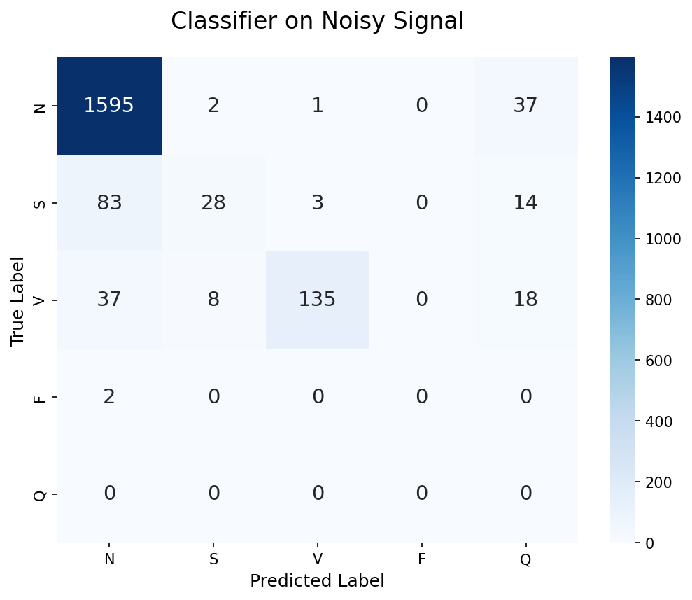
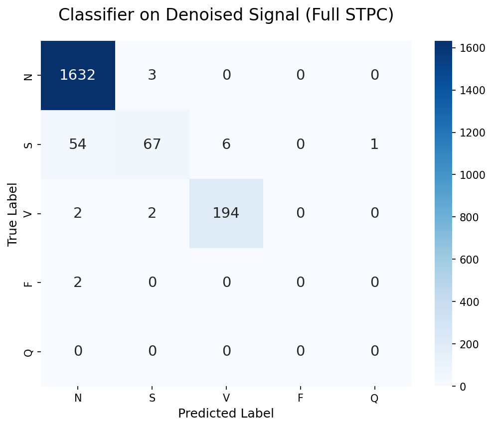
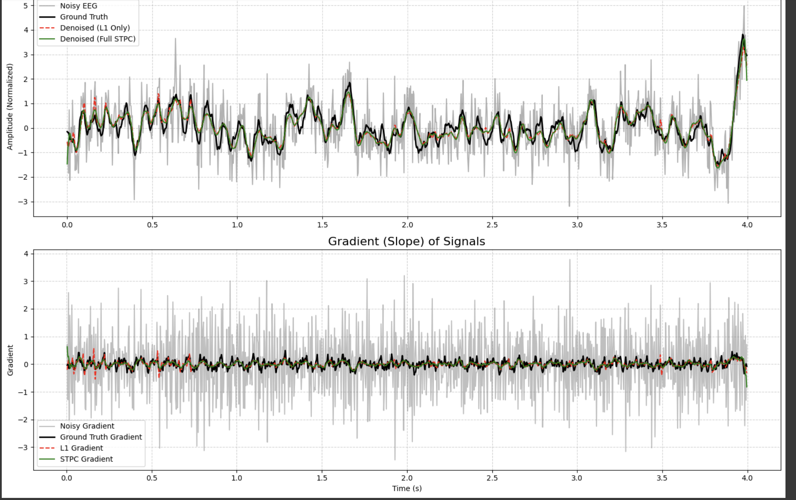
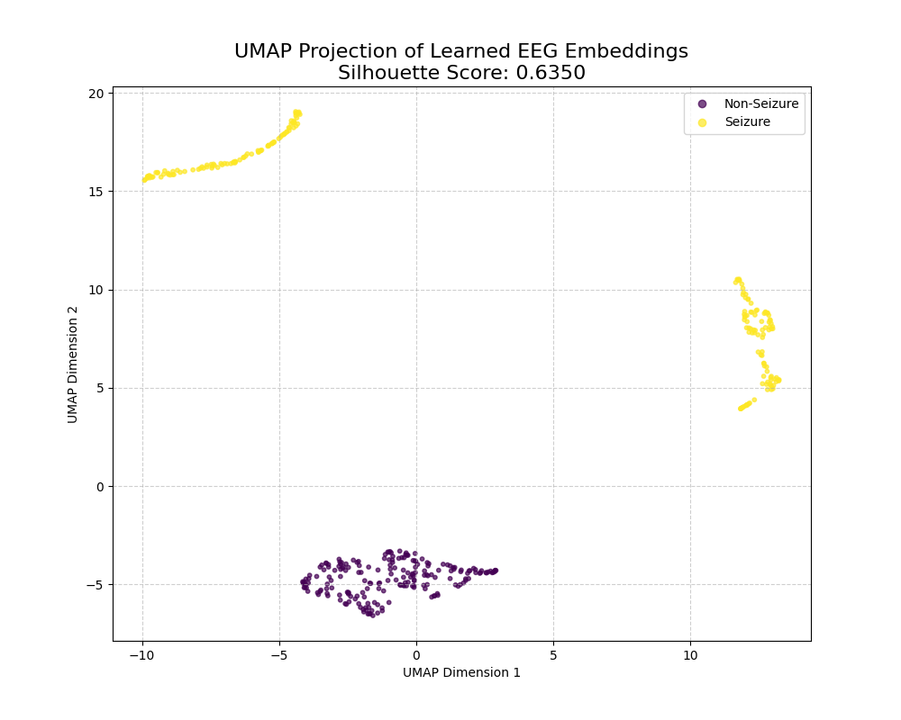

# STPC: A Physics-Informed Framework for Trustworthy Biomedical AI

[](https://opensource.org/licenses/MIT)
[](https://www.python.org/downloads/release/python-390/)
[](https://pytorch.org/)

This repository contains the official implementation of **Spectral-Temporal Physiological Consistency (STPC)**, a novel deep learning regularizer designed to produce trustworthy, physiologically plausible results when denoising and analyzing biomedical time-series signals like ECGs and EEGs.

The core principle is that for AI to be trusted in clinical settings, it must respect the underlying physics of the signals it analyzes. Traditional methods that only minimize amplitude error (like L1 or MSE loss) often produce oversmoothed or unrealistic outputs. STPC solves this by training models to simultaneously preserve three key properties:

1.  **Amplitude Consistency:** The signal's voltage levels are correct.
2.  **Temporal-Gradient Consistency:** Sharp, high-velocity events (like a QRS spike or seizure onset) are preserved, preventing dangerous blurring.
3.  **Spectral-Magnitude Consistency:** The signal's frequency "fingerprint" is maintained, ensuring it has a realistic harmonic profile.

---

## Key Results & Capabilities

The STPC framework enables robust signal reconstruction and unlocks powerful downstream applications, from improving diagnostic accuracy to learning meaningful neural representations from unlabeled data.

### 1. Superior Denoising → Improved Clinical Diagnosis (ECG)

By first cleaning a noisy ECG with an STPC-trained denoiser, we dramatically improve the accuracy of a downstream arrhythmia classifier. The F1-score for detecting critical **Ventricular beats increased by 35%**, and for **Supraventricular beats by 85%**.

|           Classifier on Raw Noisy Signal           |               Classifier on STPC-Denoised Signal                |
| :------------------------------------------------: | :-------------------------------------------------------------: |
|  |  |

### 2. Generalization to Complex Neurological Signals (EEG)

STPC is a general principle, not just an ECG-specific trick. When applied to a noisy EEG signal during a seizure, it flawlessly preserves the sharp, diagnostically critical spike morphology, while a standard L1 model fails.



### 3. Unsupervised Discovery of Brain States

This is the most powerful application. By training an STPC-regularized model on a self-supervised task (masked signal reconstruction), the model spontaneously learns to differentiate between healthy and pathological brain states **without ever seeing a single label**. The learned embeddings form distinct clusters, proving the model has discovered a meaningful, high-level "vocabulary" of the brain.

|      Spatially Incoherent (L1 Only) vs. Plausible (STPC)      |       Learned Embeddings Separate Seizure vs. Non-Seizure       |
| :-----------------------------------------------------------: | :-------------------------------------------------------------: |
|  |  |

---

## Getting Started

### 1. Clone the Repository

```bash
git clone https://github.com/Mohan-CAS-and-hackathons/ecg-denoising-research.git
cd ecg-denoising-research
```

### 2. Set Up the Environment

We recommend using a virtual environment (e.g., venv or conda).

```bash
# Create and activate a virtual environment
python3 -m venv venv
source venv/bin/activate

# Install all required packages
pip install -r requirements.txt
```

### 3. Download the Data

Our experiments use public datasets from PhysioNet. We provide scripts and instructions in the notebooks and tutorials for downloading the necessary files (MIT-BIH Arrhythmia Database, MIT-BIH Noise Stress Test Database, CHB-MIT Scalp EEG Database).

---

## Running Experiments

The refactored codebase uses a unified experiment runner for all training and validation tasks. (Note: This is the target structure. Configuration files will be added soon).

### Training a Model

To train a model for a specific experiment, use `experiments/run_training.py`.

Example: Train the self-supervised EEG model

```bash
python -m experiments.run_training --experiment eeg_self_supervised --config configs/eeg_self_supervised.yaml
```

### Validating a Model

To validate a trained model and generate result plots, use `experiments/run_validation.py`.

Example: Generate the UMAP plot from the self-supervised model

```bash
python -m experiments.run_validation --experiment eeg_self_supervised --model_path models/eeg_denoiser_self_supervised.pth
```

---

## Project Structure

```
Code
├── assets/               # Images and GIFs for documentation
├── data/                 # Placeholder for downloaded datasets
├── models/               # Placeholder for trained model weights (.pth)
├── notebooks/            # Original experimental and exploratory notebooks
├── results/              # Output from validation scripts (plots, matrices)
├── src/
│   ├── stpc/             # Core STPC library (models, losses, data handlers)
│   └── experiments/      # High-level runnable scripts (run_training.py, etc.)
├── tutorials/            # Step-by-step guides for learning the framework
├── app.py                # Interactive Streamlit demo application
├── CONTRIBUTING.md       # Guidelines for contributors
├── LICENSE               # Project license (MIT)
└── README.md             # You are here!
```

---

## Project Hub and Archival

This project is officially archived and documented on the Open Science Framework (OSF) and Zenodo.

*   **OSF Project Page:** [https://osf.io/YOUR_PROJECT_ID/](https://osf.io/YOUR_PROJECT_ID/)
*   **Citable DOI (Zenodo):** [https://doi.org/10.5281/zenodo.YOUR_DOI_NUMBER](https://doi.org/10.5281/zenodo.YOUR_DOI_NUMBER)

---

## How to Contribute

We welcome contributions of all kinds! Please see our `CONTRIBUTING.md` file for detailed guidelines on how to report bugs, propose new features or experiments, and submit pull requests.

---

## License

This project is licensed under the MIT License - see the LICENSE file for details.
